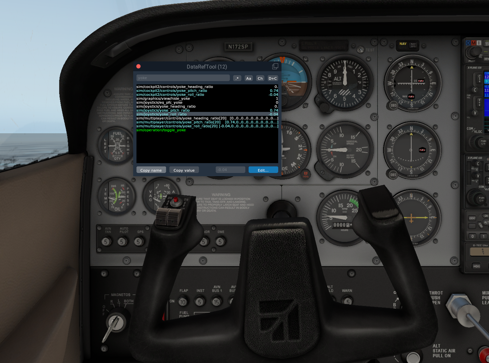
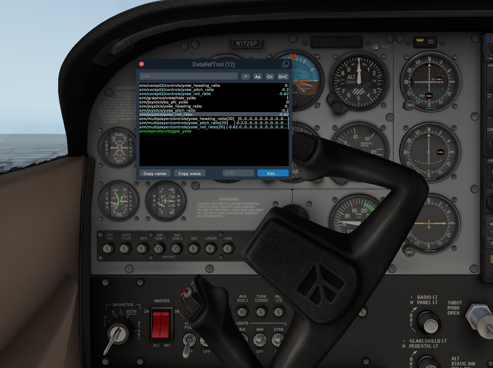
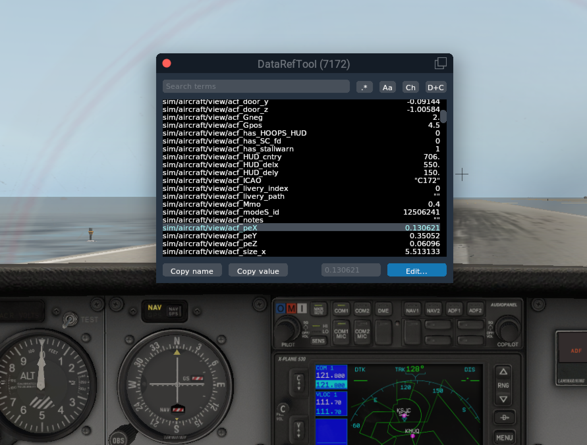
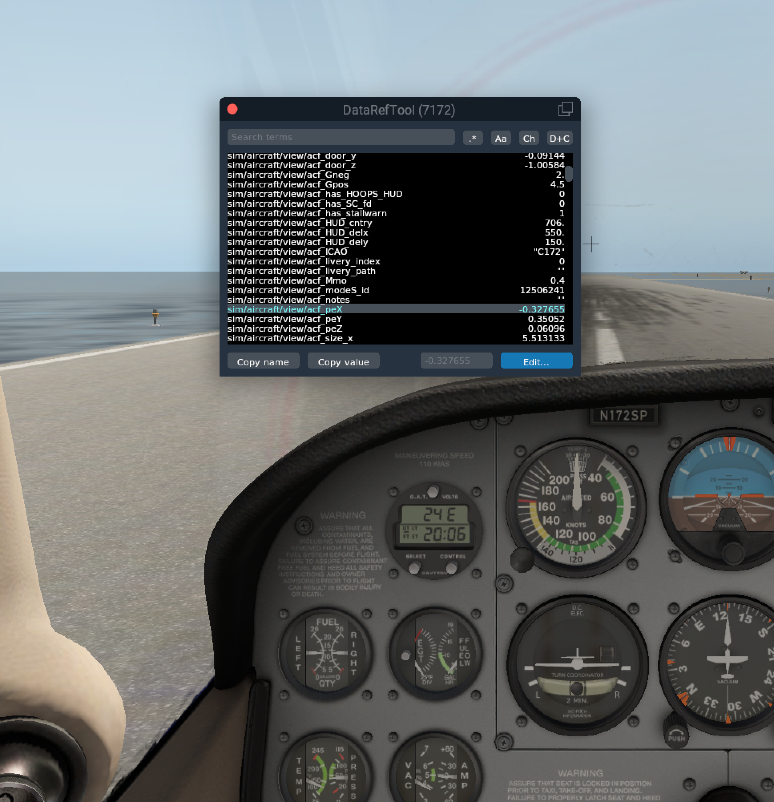
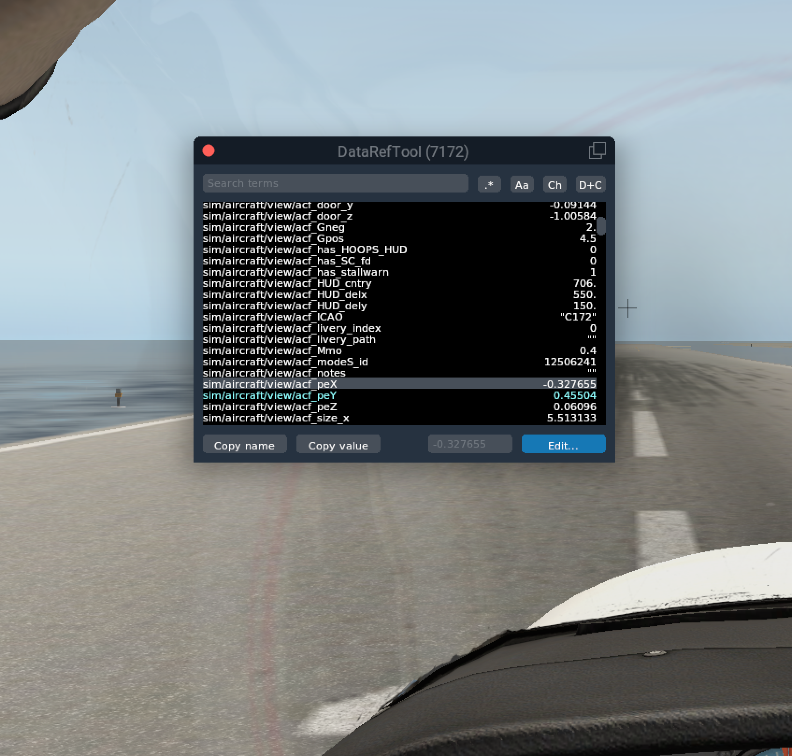
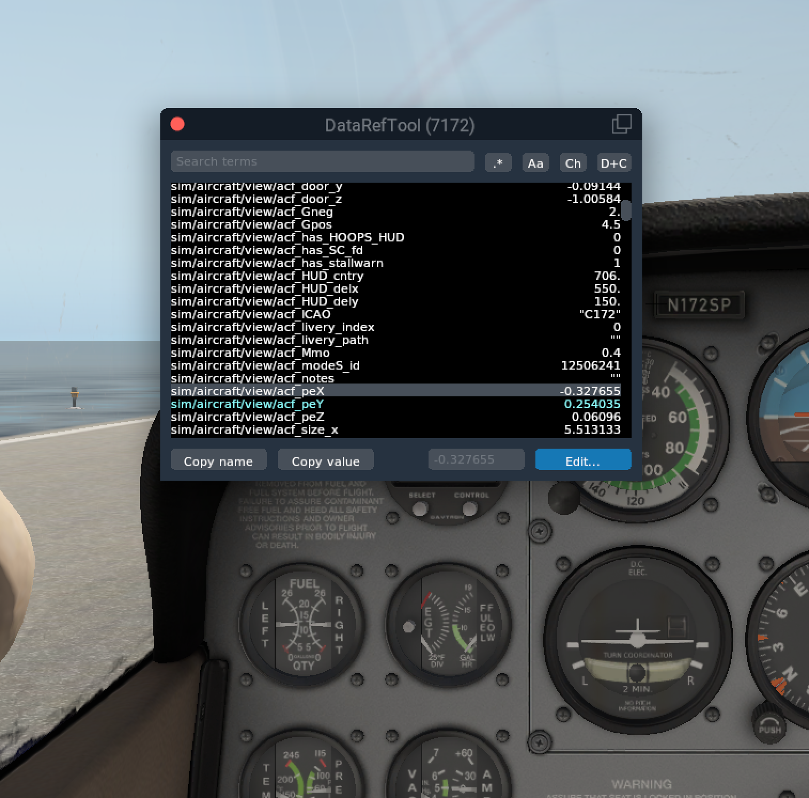

# **Delphi_assignment**
This is the take home coding assignment for Delphi tech corp.
in order to run this code you should:
- first install X-plane application
 from [ https://www.x-plane.com/ ]
- Download the latest release of XPlaneConnect-1.2.1 from [https://github.com/nasa/XPlaneConnect/releases]
- Copy the contents of the XPlaneConnect.zip archive to the plugin directory ([X-Plane Directory]/Resources/plugins/)
- Download Datareftool from [https://github.com/leecbaker/datareftool]

- Copy the contents of the DataRefTool_XP11_2021_07_14 folder to the plugin directory ([X-Plane Directory]/Resources/plugins/) 

- If set up correctly, you can open up the plugin within X-Plane by going Plugins>DataRefTool>Search

**Yoke Datarefs**

- sim/joystick/yoke_pitch_ratio
- sim/joystick/yoke_roll_ratio

**Camera Datarefs**

- sim/aircraft/view/acf_peY
- sim/aircraft/view/acf_peX
- sim/aircraft/view/acf_peZ

**Compass Heading Datarefs**
g

- sim/cockpit/misc/compass_indicated
- sim/cockpit2/gauges/indicators/compass_heading_deg_mag

**Recording Datarefs during flight**

By running Datarefs.py, the plane's pitch and roll values during the flight will be saved in lists and their graph will be showed at the end of the flight. This file is a modified version of the  basicExample.py file, an example from XPlaneConnect to demonstrate how to use the client.

**Recording Datarefs for playback**

By running PlayBack.py, the plane's pitch value will be saved to a text file which can later be used for setting the yokes values during playback.  This file is a modified version of the playbackExample.py file, a python script from XPlaneConnect to demonstrate how to record values and use them for playback.
